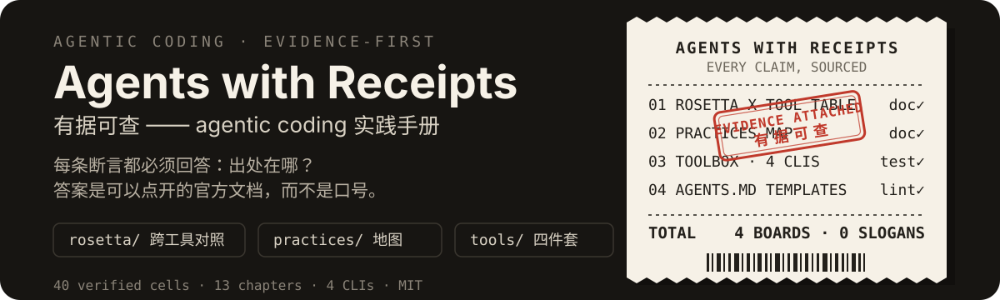

[English](README.md) | 简体中文

# agents-with-receipts

**agents-with-receipts** 是一套实践手册加四个零依赖 CLI，回答两个问题：agent **读得懂**你的仓库吗，agent 在里面**验得动**自己的工作成果吗。

<p align="center">
  
</p>

<p align="center">
  <a href="https://github.com/alloevil/agents-with-receipts/actions/workflows/ci.yml"></a>
  <a href="https://github.com/alloevil/agents-with-receipts/releases/latest"></a>
</p>

<p align="center"><strong><a href="https://alloevil.github.io/agents-with-receipts/">→ 在线阅读（GitHub Pages）</a></strong> · 左侧票根导航 · 内容与仓库 Markdown 实时同源</p>

## 60 秒上手

两条命令，都对着**你自己的仓库**跑——一条问题一条命令。Node ≥ 20，没有依赖要装。

```bash
git clone https://github.com/alloevil/agents-with-receipts.git

# agent 读得懂我的仓库吗？——AGENTS.md、规则、hooks、skills、CI 门禁
node agents-with-receipts/tools/agents-doctor/index.mjs 你的仓库/

# agent 在里面验得动自己的工作成果吗？——单命令验证、确定性、失败证据
node agents-with-receipts/tools/verify-doctor/index.mjs 你的仓库/
```

每项检查一行，最后一行是汇总。下面是本仓库检查自己的结果：

```text
agent-ready: ok 4 · warn 0 · error 0
verify-ready: ok 2 · warn 5 · error 0
```

凡不是 `ok` 的行都会点明文件、缺哪份证据，以及修法对应的官方文档链接。只有出现 `error` 才以退出码 1 收场，所以两条都能直接进 CI。

## 这是什么

| 板块 | 是什么 | 回答哪条轴 | 规模 |
|---|---|---|---|
| [`rosetta/`](rosetta/) | 跨工具对照表：同一概念在 Claude Code、Codex、Cursor、Copilot 里各叫什么、文件放哪、就近规则差在哪 | 读得懂 | 10 概念 × 4 工具 = 40 格，每格都是官方文档链接，2026-08 逐格核实 |
| [`practices/`](practices/) | 实践手册章节。每条实践按「场景 → 做法 → 依据 → 边界」展开，做法给可复制示例 | 00-08 + 12 读得懂，09-11 验得动 | 13 个章节，其中第 00 章是可跟做的 walkthrough |
| [`tools/`](tools/) | 把这些章节变成能真跑的检查，粒度覆盖单个文件到整个仓库 | 两条轴都覆盖 | 4 个 CLI · 5 条 lint 规则 · 8 项 doctor 检查 · 10 项 verify-doctor 检查 |
| [`templates/`](templates/) | 从真实项目提炼的 `AGENTS.md` / `RULES.md` 骨架，注释里写明用法 | 读得懂 | 2 份骨架，都保证过 lint |

把四样东西攥在一起的只有一条规矩：没有出处的条目不收。本仓库在 CI 里 dogfood 全套。

## 安装

Node ≥ 20，没有依赖需要装——四个 CLI 都是只用标准库的单文件 Node ESM 脚本，所以上面那条 clone 就是全部安装步骤。

四个工具也在 package.json 的 `bin` 里声明了，`npm link` 之后可以直接用 `agentsmd-lint` / `agents-doctor` / `agents-init` / `verify-doctor` 命令名。

## 我该从哪看起？

| 你想做的事 | 从这里进 |
|---|---|
| **第一次给仓库配 agent 基建** | 跟做 [`00 walkthrough`](practices/00-agent-ready-walkthrough.md)：AGENTS.md → 条件规则 → hook → lint 进 CI，每步可验证 |
| **给仓库写一份 AGENTS.md / CLAUDE.md** | [`templates/`](templates/) 骨架起步，对照 [`01 Memory 文件`](practices/01-memory-files.md)的取舍原则 |
| **不知道该用 memory 还是 rule 还是 hook** | [`02 机制选型`](practices/02-mechanism-selection.md)：两个维度定位五种机制 |
| **检查已有的 AGENTS.md 写得好不好** | 跑 [`agentsmd-lint`](tools/agentsmd-lint/)（查文件）和 [`agents-doctor`](tools/agents-doctor/)（查整仓基建） |
| **想让 agent 自己验证、敢自动合 PR** | 先看 [`09 可验证的仓库`](practices/09-verifiable-repo.md) 的阶段顺序，再跑 [`verify-doctor`](tools/verify-doctor/)：按阶段报出验证回路的缺口 |
| **改 UI 想要 agent 交出看得见的证据** | [`11 验证技能`](practices/11-verification-skills.md)：失败截图/trace、驱动真实应用、视觉证据进 PR——由 `verify-doctor` 的 `ui-evidence` 机械核查 |
| **接手不熟的代码，或想知道它为什么长成这样** | [`12 理解陌生代码库`](practices/12-codebase-mental-model.md)：`/how` 问运行时、`/why` 查历史动机、`/teach` 要取舍，并固化成一份可提交的 skill |
| **在换工具，或 Claude Code / Codex / Cursor 混着用** | [`rosetta/`](rosetta/) 对照表：同一概念各家叫什么、放哪、就近规则差在哪 |
| **系统过一遍 agentic coding 的实践全景** | [`practices/`](practices/) 十三个章节，每条实践「场景→做法→依据→边界」带官方出处 |
| **发现内容过期或有错** | [CONTRIBUTING.md](CONTRIBUTING.md)——带官方链接来提 PR，过期条目删除而非堆积 |

只有十分钟的话：读 [`rosetta/`](rosetta/) 的「收敛格局」和「就近规则差异」两节，然后对自己的仓库跑一次 linter。

## rosetta——同一概念，四种叫法

<p align="center">
  
</p>

概念在四个工具里的叫法和位置各不相同：memory 文件、条件规则、skills、hooks、沙箱、审批、MCP、headless。[`rosetta/`](rosetta/) 是一张**逐格对照官方文档核实**的对照表——每个单元格本身就是官方文档链接，点开即可验证（2026-08 核实，也记录了四家正在收敛的四个层面与 monorepo 里四种不同的"就近"语义）。

一个立刻能用的结论：**根级 `AGENTS.md` 做单一事实源**（[agents.md](https://agents.md) 开放标准，60k+ 项目在用；Cursor 与 Copilot 已原生读取），`CLAUDE.md` 软链过去：

```bash
ln -s AGENTS.md CLAUDE.md
```

## practices——十三个章节，每条带出处

<p align="center">
  
</p>

[`practices/`](practices/) 是十三个章节的实践手册：[00 可跟做的 walkthrough](practices/00-agent-ready-walkthrough.md)（从零配齐 agent 基建）+ 01-11 章（Memory 文件 / 机制选型 / 任务框架 / 验证闭环 / 权限沙箱 / 上下文管理 / 并行编排 / 安全治理 / 可验证的仓库 / 硬约束下沉 / 验证技能）+ [12 理解陌生代码库](practices/12-codebase-mental-model.md)（`/how` 问运行时、`/why` 查 git 历史动机、`/teach` 要取舍、`/recall` 取回上下文，并把它固化成一份可提交的 skill）。每条实践按「**场景 → 做法（可复制示例）→ 依据（官方链接）→ 边界**」展开——不是要点索引，是能照着做完的工作流。

配套 [`templates/`](templates/)：从真实项目提炼的 `AGENTS.md` / `RULES.md` 骨架，注释里写明用法，和下面的 linter 配合使用。

## tools——四个可执行的检查

<p align="center">
  
</p>

把实践变成可执行检查的四件套。零依赖，Node ≥ 20：

| 工具 | 一条命令 | 干什么 |
|---|---|---|
| [`agentsmd-lint`](tools/agentsmd-lint/) | `node tools/agentsmd-lint/index.mjs AGENTS.md` | 查**单个文件**质量：行数超标 / 占位符 / 模糊措辞 / 引用不存在的 npm 脚本 / 空标题节 |
| [`agents-doctor`](tools/agents-doctor/) | `node tools/agents-doctor/index.mjs .` | 查**整个仓库**的 agent 基建：AGENTS.md 质量、CLAUDE.md 软链/漂移、四工具的规则/hooks/skills、决策记录是否从 AGENTS.md 指得到、secrets 是否 gitignore、CI 门禁 |
| [`agents-init`](tools/agents-init/) | `node tools/agents-init/index.mjs . --link` | 探测 package.json / Cargo.toml / pyproject / go.mod，生成**预填真实命令**的 AGENTS.md 起点 + CLAUDE.md 软链，产物自动过 lint |
| [`verify-doctor`](tools/verify-doctor/) | `node tools/verify-doctor/index.mjs .` | 查 agent 能不能在这个仓库里**自己验证工作成果**：单命令验证回路、确定性、失败证据、UI 证据（截图/trace）、模块边界、类型严格度、lint 硬度、逃逸口棘轮、flaky 隔离、证据模板——10 项检查按阶段 0-5 分组输出 |

四个工具发现 error 都以退出码 1 收场，可直接进 CI。`verify-doctor` 查出的阶段缺口默认是 warn（`--strict` 才升为 error），接入它不会让仓库一夜变红。本仓库 dogfood 全套：CI 里跑 lint 门禁 + doctor 体检 + verify-doctor，根目录的 `AGENTS.md` 就是 `agents-init` 生成后手工补充的。

## 给 agent 的接口

这个仓库的读者一半是 agent。把 `✓ [agents-md] AGENTS.md 存在且通过 agentsmd-lint` 这样一行人类报告丢给 agent、让它正则抠出结论，这不叫输出格式，这叫接口缺失。所以每个 CLI 都有一份机器可读的输出。

四个工具都接受 `--json`，往 stdout 写同一套结构：

```json
{
  "tool": "verify-doctor",
  "target": "/abs/path/to/repo",
  "summary": { "ok": 2, "warn": 5, "error": 0, "info": 2 },
  "results": [
    { "id": "verify-command", "level": "warn", "message": "...", "advice": "...", "stage": 0 }
  ]
}
```

- `target` 是绝对路径。只有 `agentsmd-lint` 例外：它接收多个文件，所以 `target` 是绝对路径数组，且每条结果额外带 `file`。
- `level` 只有 `ok` / `warn` / `error` / `info` 四种取值，不会出现第五种。
- `info` 不等于通过。它标记的可能是「命中了但不算缺陷」，也可能是「这项检查在这个仓库里无可检之物」——例如在 `verify-doctor` 没有对应探测的技术栈上做逃逸口统计。消费方要判断「这项检查过了吗」，必须判 `ok`，而不是判「不是 `error`」。
- `stage` 是 0-5 的整数，只有 `verify-doctor` 输出。`agentsmd-lint` 的条目改带 `line`，命中没有行号时省略该键。
- `advice` 是可选字段。不适用的字段就是没有这个键，而不是 `null`。
- 带 `--json` 时 stdout 只有一个 JSON 对象：没有人类输出行，没有 ANSI 转义。
- 退出码与人类模式完全一致：`0` 干净，当且仅当存在 `error` 级结果时为 `1`，用法错误为 `2`。用法错误时四个工具都只往 stderr 写一行用法、stdout 保持为空，解析方不会读到半个对象。
- 四个工具也都接受 `--help`，打印用法、全部 flag 与退出码含义，且一律以 0 退出。

检索有两个入口：[`llms.txt`](llms.txt) 索引整个仓库，每份文档一行说明用途；各工具 README 里有自己那套检查 id 的字段表——[agentsmd-lint](tools/agentsmd-lint/)、[agents-doctor](tools/agents-doctor/)、[agents-init](tools/agents-init/)、[verify-doctor](tools/verify-doctor/)。

## 为什么可信

**每条断言都必须回答一个问题：*出处在哪？*** 答案是可以点开的官方文档，而不是口号。

Claude Code、Codex、Cursor 的最佳实践收藏已经很多，但几乎全是无出处的断言（"保持 CLAUDE.md 简短"、"先规划再编码"）。这里的做法：对照表**逐格核实官方文档、每格就是链接**；实践地图每条带出处与验证日期；再配上真的能跑的检查器——一个查 agent 能不能读懂这个仓库，一个查 agent 能不能自己验证工作成果。

从这条规矩推出四条立场：

1. **证据优先。** 没有出处的断言不收；对照表的每一格都是官方文档链接。
2. **半衰期意识。** 这个领域几个月一变；每条标注适用工具与日期，过期即删。
3. **宁缺毋滥。** 手册的价值密度由最差的一条决定。
4. **可执行 > 可读。** 能写成 lint 规则、模板、脚手架的实践，不要只写成散文。

这里引用的每个数字都可以重算：[`claims.json`](https://alloevil.github.io/agents-with-receipts/claims.json) 给每个数字都配了它度量的是什么，以及能复现它的那条命令。

## 什么时候用

- 第一次给仓库配 agent 基建——第 00 章从 AGENTS.md → 条件规则 → hook → lint 进 CI，每步都能验证。
- 在换工具或多工具混用（Claude Code / Codex / Cursor / Copilot）：`rosetta/` 告诉你同一概念各家叫什么、文件放哪、monorepo 里「就近优先」的语义差在哪。
- 已经有 AGENTS.md，想知道写得好不好——linter 会抓出模板残留的占位符、引用了不存在的 npm 脚本、agent 无法执行的模糊措辞、空标题节、行数超标。
- 团队上手前先做一次仓库体检：`agents-doctor` 报告 memory 文件质量、CLAUDE.md 漂移、四家的 rules/hooks/skills 配了哪些、敏感文件是否 gitignore、CI 有没有门禁。
- 准备让 agent 自己合 PR，需要先知道验证回路撑不撑得住：`verify-doctor` 按阶段报出——有没有一条命令跑完全部验证、这条命令是否确定、失败有没有留下 agent 能直接读的证据、类型与 lint 的逃逸口有没有被棘轮压着只降不升。
- 在写团队规范，需要每条规则都带一个同事能点开核实的出处。

## 什么时候别用

- **想要效率或性能数字。** 这里没有，而且是刻意的。[`claims.json`](https://alloevil.github.io/agents-with-receipts/claims.json) 只数本仓库自己的产物（40 个带出处单元格、13 个章节、4 个工具、5 条 lint 规则、8 项 doctor 检查、10 项 verify-doctor 检查、这些检查能识别的 5 个技术栈、4/4 个 CLI 支持 `--json`、0 依赖）。没有任何「照做就更快/更准」的断言——因为没测过。
- **需要保证时效的厂商事实。** 对照表标的是 **2026-08**。这个领域几个月一变——每格都是链接正是为了这个：下判断前把你真正依赖的那一格点开重核一遍。
- **想让工具直接改你的文件。** 除 `agents-init`（写新的 AGENTS.md，已存在时不加 `--force` 拒绝覆盖）外，其余都只读只报。
- **想让 `verify-doctor` 顺手把缺口补上。** 它是检测器不是修复器：只报出缺在哪个阶段、缺哪份证据，不动你的测试、配置和 CI。它也不自带 dependency-cruiser 或 betterer——零依赖是这里的规矩——只检测你是否已经采用了这类工具。
- **想让 `verify-doctor` 什么语言都懂。** 它的探测是按生态写的，目前覆盖五个栈：**JS/TS、Python、Go、Rust、Java/Kotlin**。其他语言上，恰好有四项仍然能给出结论——`verify-command`、`failure-artifacts`、`module-boundary`、`evidence-template`，因为它们读的是 CI YAML 与仓库文件而不是源码；另外五项 `determinism`、`type-strict`、`lint-hardness`、`escape-ratchet`、`flaky-quarantine` 在那里**永远不会报 `ok`**：无可检之物时报 `info` 并写明不适用的原因，只有出现与语言无关的命中（例如验证命令没固定 `TZ`）才升到 `warn`。`ui-evidence` 不在这两列里：它认的是 Playwright/Cypress 配置而不是语言探针，任何技术栈上都有效，没有浏览器测试框架时报 `info` 而不是绿灯。这是设计规则而不是没做完：**某项检查无可检之物时一律报 `info`，绝不报 `ok`**；`ok` 只能表示「查过了，确实干净」。一个实际含义是「这条探测不适合你的仓库」的绿灯，信息量为零——它正是 [第 10 章](practices/10-hard-constraints.md) 批判的「warn 等于不存在」的镜像。
- **Node < 20**，或者想要一个已发布的 npm 包——工具以源码形式随仓库分发。
- **想看模型选型或 prompt 工程的观点。** 范围是仓库侧的两条轴：agent 读得懂这个仓库吗（memory 文件、规则、skills、hooks、沙箱、审批、MCP、headless），agent 在里面验得动自己的工作成果吗（验证命令、确定性、失败证据、UI 证据、模块边界、逃逸口棘轮、flaky 隔离）。

## 常见问题

**四个工具的区别是什么？**
作用范围不同。`agentsmd-lint` 查**单个 memory 文件的内容**：行数、未填的占位符、模糊措辞、引用了同目录 package.json 里不存在的脚本、空标题节。`agents-doctor` 查整个仓库里**围绕这些文件的基建**：AGENTS.md 质量、CLAUDE.md 是软链还是已漂移的副本、四家的 rules/hooks/skills 目录各配了几个、决策记录能不能从 AGENTS.md 指得到、敏感文件是否被 gitignore 覆盖、CI 里有没有 lint 门禁。`agents-init` 面向还没有 AGENTS.md 的仓库，从探测到的构建工具生成一份，然后对自己的产物跑一遍 lint。`verify-doctor` 换的是另一条轴：它不问仓库有没有把自己解释给 agent，而问仓库有没有让 agent 能**自己检查自己**——一条命令跑完全部验证、确定性、失败证据、agent 看得见的 UI 证据、模块边界、类型与 lint 硬度、逃逸口棘轮、flaky 隔离，以及 PR 流程里的证据模板。

**为什么 `agents-init` 只写探测到的命令？**
因为 memory 文件里编造的命令比没有 memory 文件更糟——agent 照着跑、跑失败，而这个文件刚刚教给它一件假事。它读 package.json scripts、Cargo.toml、pyproject.toml、go.mod，只收真实存在的条目（`packageManager` 含 pnpm/yarn 时换前缀），pyproject 里没有 pytest 痕迹就只留注释而不编命令；写完自动跑 agentsmd-lint，有 error 级命中就退出码 1。

**`CLAUDE.md` 应该软链到 `AGENTS.md` 吗？**
这是本仓库的建议，实现就一行 `ln -s AGENTS.md CLAUDE.md`：`AGENTS.md` 是 Cursor 与 Copilot 已原生读取的开放标准，软链过去意味着只维护一份而不是每家一份。`agents-doctor` 按三档评价——软链 ok，内容相同的独立副本 info（能用，但会漂移），已漂移或缺失 warn。代价是：软链意味着所有工具看到完全相同的指令，如果你确实需要某家专属的指引，这样就不合适。

**对照表有多新？厂商改了怎么办？**
2026-08 逐格核实，日期写在表上而不是暗示。每个单元格的文字本身就是官方链接，所以任何一格都能一键重核，不必整表照信。修正以 PR 形式接收，要求附官方链接；过期条目直接删除，而不是加注保留。

**许可是什么，能用在公司内部文档里吗？**
代码 MIT；文档内容同时以 CC BY 4.0 提供，所以章节和表格行可以署名后拷进内部文档。引用时请引承载该断言的那一页（例如 `practices/05-permissions-sandbox.md`），并保留背后的官方链接——这样你的读者也拿到了那张收据。

## 贡献

见 [CONTRIBUTING.md](CONTRIBUTING.md)。一句话版本：**新条目必须带官方出处**，修正过期信息的 PR 请附官方链接。

## License

[MIT](LICENSE)。文档内容同时以 [CC BY 4.0](https://creativecommons.org/licenses/by/4.0/) 提供。
